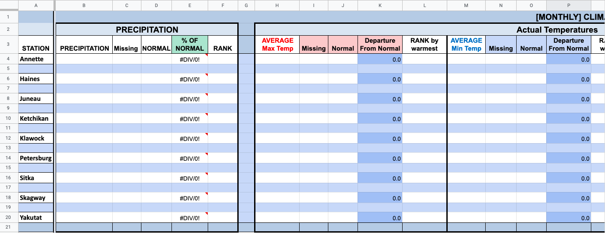

# xmasic2_climate_summary
Pulls climate information from the [xmacis website](https://xmacis.rcc-acis.org/) for specific locations to create a monthly summary.

Copy google sheet template with script and make it your own. You will need to adjust the script to match your sheet. 
[Link to Google Sheet Template](https://docs.google.com/spreadsheets/d/1zeZTXVL51DVJ-CJ52h4oB06VnXa63g6jLKyED2XapCE/edit?usp=sharing)

## **DO NOT**
Download sheet and REUPLOAD it as an excel sheet. This will eliminate the script!!!
Change any sheet names or the layout/design!!!

## STEPS:

1. Create your own copy on your own google account
2. Adjust the template to fit your needs. The script is directed at each climate site and column, so you **MUST** adjust the google script as well
3. Once you have your YYYY-MM and google script adjusted, make a copy of that sheet and rename it to match the year and month (i.e. 2022-01). For annual data just use the year (i.e. 2022).

4. Click “Run Script -> Update Climate” located next to “Help”
5. “Running Script” in green will appear. Wait until is disappears to look at the data
6. Cell formatting will adjust colors to make them pop more
... M - missing is used for months with over 3 days of missing data.
... Be sure to verify your data

7. If you want records too, hit  “Update Records”
8. “Running Script” in green will appear. Wait until it disappears to look at the data. This will take about 15 seconds. 
... If there are multiple years with the same value, your record may pull in a different order than xmacis would, but the value should not be that far off.

*All data is based on no more than 3 days of missing data.
